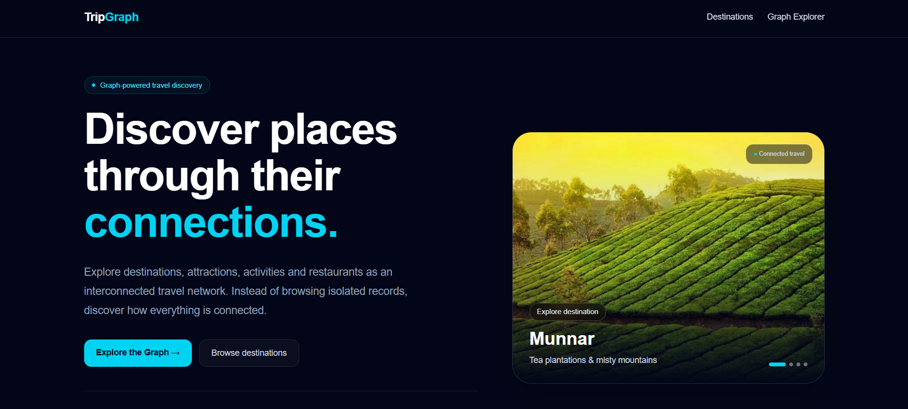
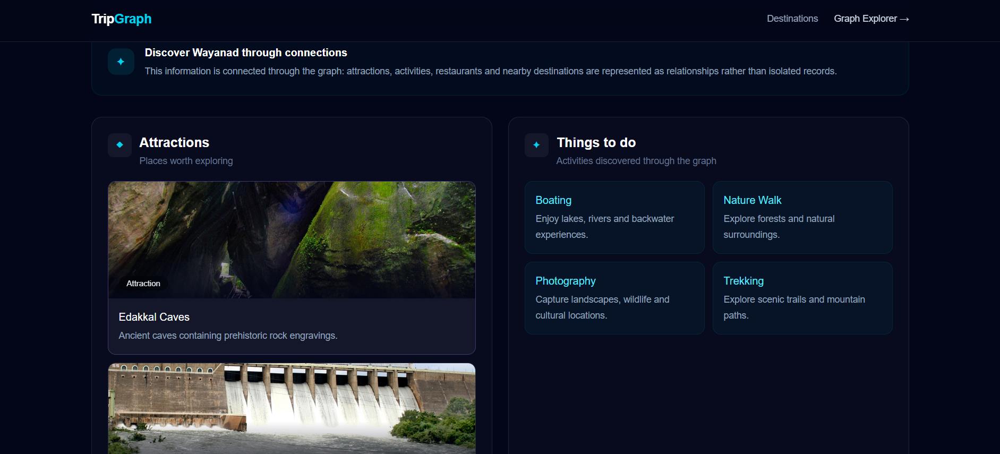
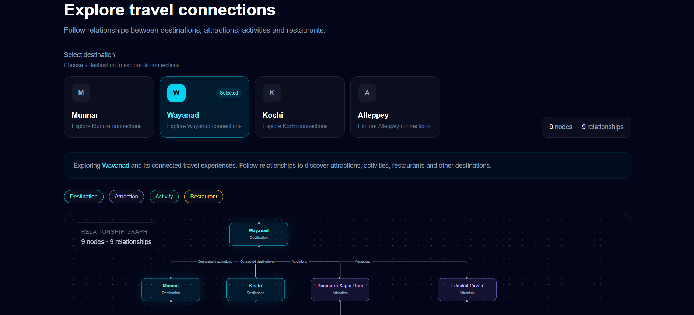

# TripGraph

TripGraph is a graph-powered travel discovery application built to demonstrate how travel information can be modeled and explored through relationships.

Instead of treating destinations, attractions, activities, restaurants, and nearby destinations as isolated records, TripGraph represents them as connected entities using a graph database.

The application provides a simple travel interface along with an interactive graph explorer that allows users to understand how different travel entities are connected.

## Live Demo

https://tripgraph-am16.vercel.app/

## Overview

Traditional travel applications generally organize information into separate lists such as destinations, attractions, restaurants, and activities.

TripGraph takes a different approach by modeling these entities as a connected graph.

For example, a destination can have multiple attractions, attractions can offer activities, restaurants can belong to destinations, and destinations can be connected to other destinations.

This makes it possible to explore travel information through relationships and multi-hop connections.

## Features

- Browse Kerala destinations
- View detailed destination information
- Explore destination attractions
- Discover activities available through attractions
- View restaurants associated with destinations
- Navigate between connected destinations
- Interactive graph visualization
- Hierarchical graph layout
- Relationship labels with user-friendly descriptions
- Destination and attraction images
- Responsive dark-themed interface
- Dynamic destination pages
- Graph data retrieved from Neo4j
- Deployed on Vercel

## Graph Model

TripGraph uses a graph-based model to represent travel information.

The main entities are:

- Destination
- Attraction
- Activity
- Restaurant

The relationships between these entities are:

Destination
├── HAS_ATTRACTION ──→ Attraction
│                         └── OFFERS ──→ Activity
│
├── HAS_RESTAURANT ──→ Restaurant
│
└── CONNECTED_TO ──→ 

How to Run Locally

The live application can be tested directly using the Live Demo above. Local setup is optional and is mainly useful for development or reviewing the source code.

Prerequisites
Node.js 18+
npm
CognoDB database
1. Clone the Repository
git clone https://github.com/jithin045/tripgraph.git
cd tripgraph
2. Install Dependencies
npm install
3. Configure Environment Variables

Create a .env.local file in the project root.

Add the following variables:

COGNODB_URI=your_cognodb_uri
COGNODB_USERNAME=your_cognodb_username
COGNODB_PASSWORD=your_cognodb_password

Replace the values with the connection details of your CognoDB database.

Do not commit .env.local or database credentials to the repository.

4. Run the Development Server
npm run dev

The application will be available at:

http://localhost:3000

5. Production Build

To create a production build:

npm run build

To run the production build locally:

npm start
API

TripGraph uses a Next.js API route to retrieve graph data for the interactive graph explorer.

Example endpoint:

GET /api/graph/[slug]

Example:

GET /api/graph/munnar

The API returns the graph nodes and relationships required by the interactive graph visualization.

Graph Visualization

The interactive graph is implemented using React Flow for rendering the graph and Dagre for automatically arranging the nodes in a hierarchical layout.

Database relationship names are mapped to user-friendly labels in the interface:

HAS_ATTRACTION → Attractions
HAS_RESTAURANT → Restaurants
OFFERS → Activities
CONNECTED_TO → Nearby destinations
Deployment

TripGraph is deployed using Vercel.

Live application:

https://tripgraph-am16.vercel.app/

## Screenshots

### Home

The home page provides an entry point to explore destinations and the graph.

### Destination

The destination page presents attractions, activities, and connected travel information.

### Graph Explorer

The graph explorer visualizes destinations, attractions, activities, and their relationships using React Flow and Dagre.

